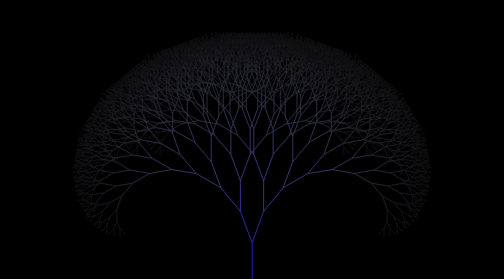

# Fractal Tree with Pygame

This Python project draws a fractal tree using **Pygame** and allows users to capture screenshots. The tree grows recursively, with each branch getting progressively darker as it moves outward.



## What is a fractal tree

A fractal tree is a type of recursive structure where each branch splits into smaller branches, forming a pattern that repeats at different scales. This creates a self-similar, tree-like shape that can grow infinitely, with branches becoming smaller and more numerous as the recursion deepens.

Learn more on [Wikipedia](https://en.wikipedia.org/wiki/Fractal).


## Run the Programm

```bash
python3 ./app.py
```

Shotcuts:
- Q: End the Programm
- SPACE: take a SCreenshot